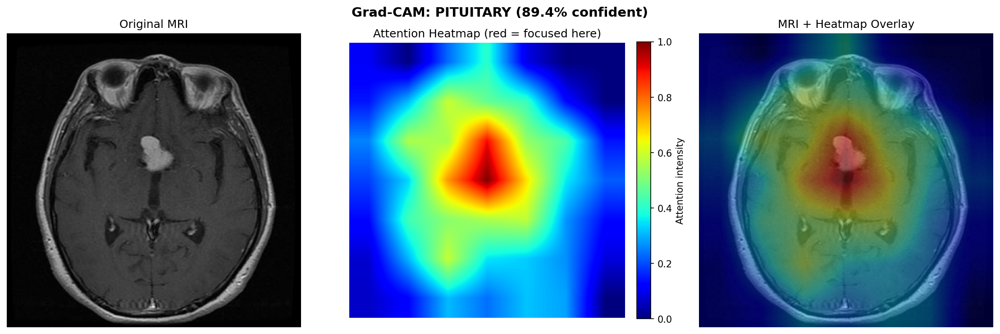

# 🧠 NeuroScan AI — Brain Tumor Detection System

<div align="center">


**A production-ready full-stack AI system for brain tumor classification from MRI scans**

[🌐 Live Demo](https://brain-tumor-detection-yw3m.vercel.app) · [📚 API Docs](https://helloyash789-brain-tumor-api.hf.space/docs) · [🤗 Hugging Face](https://huggingface.co/spaces/helloyash789/Brain-Tumor-api)

</div>

---

## 📋 Table of Contents

- [Overview](#overview)
- [Live Demo](#live-demo)
- [Model Performance](#model-performance)
- [Explainability — Grad-CAM](#explainability--grad-cam)
- [Architecture](#architecture)
- [Tech Stack](#tech-stack)
- [Project Structure](#project-structure)
- [Setup & Installation](#setup--installation)
- [API Reference](#api-reference)
- [Model Journey](#model-journey)
- [Skills Demonstrated](#skills-demonstrated)
- [Disclaimer](#disclaimer)

---

## 🗺️ Overview

NeuroScan AI classifies brain tumors from MRI scans into 4 categories using a fine-tuned Vision Transformer (ViT) model. The system combines deep learning with a FastAPI backend and React frontend — fully deployed and accessible online.

| Class | Description | Severity |
|-------|-------------|----------|
| **Glioma** | Tumor in glial cells of brain/spine | 🔴 High |
| **Meningioma** | Tumor in membranes around brain/spine | 🟠 Medium |
| **Pituitary** | Tumor in pituitary gland | 🟠 Medium |
| **No Tumor** | Healthy brain scan | 🟢 None |

---

## 🌐 Live Demo

| Service | URL | Status |
|---------|-----|--------|
| 🌐 Frontend | [brain-tumor-detection-yw3m.vercel.app](https://brain-tumor-detection-yw3m.vercel.app) |  |
| 🤗 API | [helloyash789-brain-tumor-api.hf.space](https://helloyash789-brain-tumor-api.hf.space) |  |
| 📚 API Docs | [helloyash789-brain-tumor-api.hf.space/docs](https://helloyash789-brain-tumor-api.hf.space/docs) |  |

> ⚠️ API may take 30-60 seconds to wake up on first visit (Hugging Face free tier cold start)

---

## 📊 Model Performance

Trained on the [Kaggle Brain Tumor MRI Dataset](https://www.kaggle.com/datasets/masoudnickparvar/brain-tumor-mri-dataset) — 7,023 MRI images across 4 classes.

### Final Model — Vision Transformer (ViT-Base)

| Metric | Score |
|--------|-------|
| **Validation Accuracy** | **95.06%** 🔥 |
| **Overall AUC-ROC** | **0.9866** |
| Architecture | ViT-Base Patch16 224 |
| Training Epochs | 30 |
| Augmentation | MixUp + CutMix + RandomErasing |

### Per-Class AUC-ROC

| Class | AUC-ROC |
|-------|---------|
| Glioma | 0.980 |
| Meningioma | 0.975 |
| No Tumor | 0.995 |
| Pituitary | 0.998 |

---

## 🔥 Explainability — Grad-CAM

The model doesn't just classify — it shows **exactly where it looked** to make the decision using Gradient-weighted Class Activation Mapping (Grad-CAM).



```
Left   → Original MRI scan
Middle → Attention heatmap (red = highest focus)
Right  → Overlay showing model focus region
```

**Why this matters:** In medical AI, explainability is critical. Doctors need to know not just *what* the model predicted, but *why*. The red hotspot lands directly on the tumor region, demonstrating the model has learned clinically meaningful features.

---

## 🏗️ Architecture

```
MRI Image (uploaded by user)
         │
         ▼
  ┌──────────────┐
  │   React UI   │  ← Drag & drop interface (Vercel)
  └──────┬───────┘
         │ HTTP POST /predict
         ▼
  ┌──────────────┐
  │   FastAPI    │  ← REST API backend (Hugging Face)
  └──────┬───────┘
         │
         ▼
  ┌──────────────────────────────────┐
  │   Vision Transformer (ViT-Base)  │
  │   Pretrained on ImageNet-21k     │
  │   Fine-tuned on Brain MRI        │
  │   + Grad-CAM Explainability      │
  └──────────────────────────────────┘
         │
         ▼
  Tumor Class + Confidence Score
```

### ViT Architecture Detail

```
Input MRI (224×224)
         ↓
Split into 16×16 patches (196 patches)
         ↓
Patch Embeddings + Position Encodings
         ↓
12× Transformer Blocks (last 4 unfrozen)
   └── Multi-Head Self-Attention
   └── Feed Forward Network
   └── Layer Normalization
         ↓
Classification Head
         ↓
Softmax → [Glioma, Meningioma, No Tumor, Pituitary]
```

---

## 🛠️ Tech Stack

| Layer | Technology | Purpose |
|-------|-----------|---------|
| **Model** | PyTorch + ViT-Base (timm) | Image classification |
| **Training** | Google Colab T4 GPU | GPU-accelerated training |
| **Augmentation** | MixUp + CutMix + RandomErasing | Prevent overfitting |
| **Explainability** | Grad-CAM | Model interpretability |
| **Experiment Tracking** | MLflow | Hyperparameter & metric logging |
| **Backend** | FastAPI + Uvicorn | REST API server |
| **Frontend** | React + Vite | User interface |
| **API Deployment** | Hugging Face Spaces + Docker | Cloud API hosting |
| **Frontend Deployment** | Vercel | Frontend hosting |
| **Version Control** | Git + GitHub | Source control |

---

## 📁 Project Structure

```
brain-tumor-detection/
│
├── model/
│   ├── train.py              # Training script (supports ViT, EfficientNet-B0/B2)
│   ├── predictor.py          # Inference + Grad-CAM logic
│   ├── model_config.json     # Model config (class names, img size, accuracy)
│   └── gradcam_results/
│       └── gradcam_result.png
│
├── api/
│   ├── __init__.py
│   └── main.py               # FastAPI backend
│
├── frontend/
│   ├── package.json
│   ├── vite.config.js
│   ├── index.html
│   └── src/
│       ├── main.jsx
│       └── App.jsx           # React UI
│
├── notebooks/
│   └── train_colab.ipynb     # Colab training notebook
│
├── Dockerfile                # For Hugging Face deployment
├── requirements.txt
├── .gitignore
└── README.md
```

---

## 🚀 Setup & Installation

### Prerequisites

```bash
python --version   # 3.10+
node --version     # 18+
git --version
```

### 1. Clone Repository

```bash
git clone https://github.com/YashParekh14/brain-tumor-detection.git
cd brain-tumor-detection
```

### 2. Install Python Dependencies

```bash
pip install -r requirements.txt
```

### 3. Train the Model (Google Colab recommended)

Open `notebooks/train_colab.ipynb` in Google Colab:

```python
# Change model in CONFIG:
CONFIG = {
    'model':    'vit',   # Best accuracy ~95%
    'epochs':   30,
    'mixup':    True,
    'cutmix':   True,
    'unfreeze': 4,
}
```

### 4. Run the API

```bash
python -m uvicorn api.main:app --reload --port 8000
```

### 5. Run the Frontend

```bash
cd frontend
npm install
npm run dev
# Open http://localhost:5173
```

---

## 📡 API Reference

### `GET /health`
```json
{
  "status": "healthy",
  "model_loaded": true,
  "device": "cpu"
}
```

### `POST /predict`

```bash
curl -X POST https://helloyash789-brain-tumor-api.hf.space/predict \
  -F "file=@brain_mri.jpg"
```

**Response:**
```json
{
  "filename": "brain_mri.jpg",
  "predicted_class": "pituitary",
  "display_name": "Pituitary Tumor",
  "confidence": 95.4,
  "probabilities": {
    "glioma": 1.2,
    "meningioma": 1.8,
    "notumor": 1.6,
    "pituitary": 95.4
  },
  "info": {
    "description": "A tumor that grows in the pituitary gland...",
    "severity": "Medium",
    "color": "#f97316"
  }
}
```

---

## 📈 Model Journey

This project went through multiple phases of improvement:

| Phase | Model | Accuracy | Key Change |
|-------|-------|----------|-----------|
| Phase 1 | EfficientNet-B0 | 84.38% | Baseline transfer learning |
| Phase 2 | EfficientNet-B0 | 84.50% | Comparison experiment |
| Phase 2 | ViT-Base (frozen) | 75.25% | Head-only training |
| **Phase 2B** | **ViT-Base (unfrozen)** | **95.06%** 🔥 | **Last 4 blocks fine-tuned** |

**Key insight:** ViT jumped from 75.25% to 95.06% (+19.81%) simply by unfreezing the last 4 transformer blocks. Self-attention can then properly learn to focus on tumor regions in MRI scans.

---

## 🎯 Skills Demonstrated

| Skill | Details |
|-------|---------|
| **Deep Learning** | Vision Transformer (ViT) fine-tuning |
| **Transfer Learning** | ImageNet-21k → Medical Imaging |
| **Advanced Augmentation** | MixUp, CutMix, RandomErasing |
| **Model Evaluation** | AUC-ROC, Precision, Recall, F1 |
| **Explainable AI** | Grad-CAM visualization |
| **Experiment Tracking** | MLflow |
| **REST API** | FastAPI with CORS, error handling |
| **Frontend** | React + Vite |
| **Containerization** | Docker |
| **Cloud Deployment** | Hugging Face Spaces + Vercel |

---

## 📝 Resume Description

```
NeuroScan AI — Brain Tumor Detection System
Vision Transformer (ViT) | FastAPI | React | Docker | Hugging Face | Vercel

- Fine-tuned ViT-Base on 7,023 brain MRI images achieving 95.06%
  accuracy and 0.9866 AUC-ROC (improved from 84.38% baseline)
- Discovered that unfreezing last 4 ViT transformer blocks improved
  accuracy by +19.81% over head-only training
- Implemented Grad-CAM explainability showing which MRI regions
  the model focuses on for each prediction
- Applied MixUp + CutMix augmentation and cosine annealing scheduler
- Built FastAPI backend + React frontend deployed on Hugging Face
  Spaces (Docker) and Vercel
```

---

## ⚠️ Disclaimer

This is a **research prototype** for educational purposes only. It is **not** approved or intended for clinical use. Always consult qualified medical professionals for diagnosis and treatment.

---

## 🔗 Links

- **Dataset:** [Kaggle Brain Tumor MRI Dataset](https://www.kaggle.com/datasets/masoudnickparvar/brain-tumor-mri-dataset)
- **Live Demo:** [brain-tumor-detection-yw3m.vercel.app](https://brain-tumor-detection-yw3m.vercel.app)
- **API:** [helloyash789-brain-tumor-api.hf.space](https://helloyash789-brain-tumor-api.hf.space)
- **API Docs:** [helloyash789-brain-tumor-api.hf.space/docs](https://helloyash789-brain-tumor-api.hf.space/docs)

---

<div align="center">
Made with ❤️ by <a href="https://github.com/YashParekh14/brain-tumor-detection">Yash Parekh</a>
</div>
